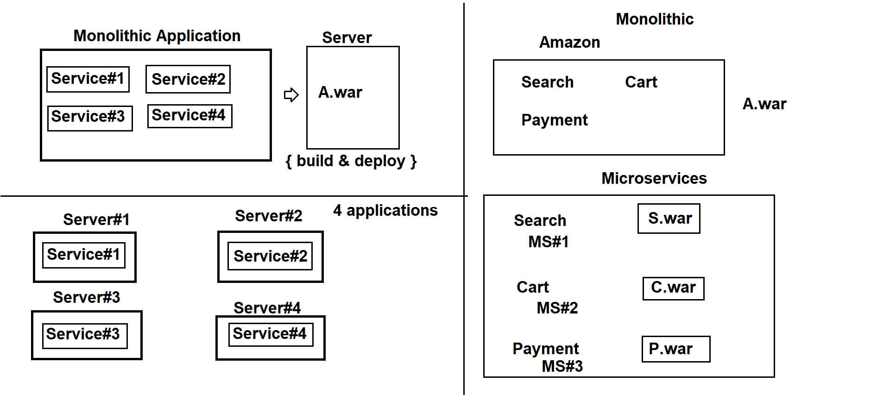
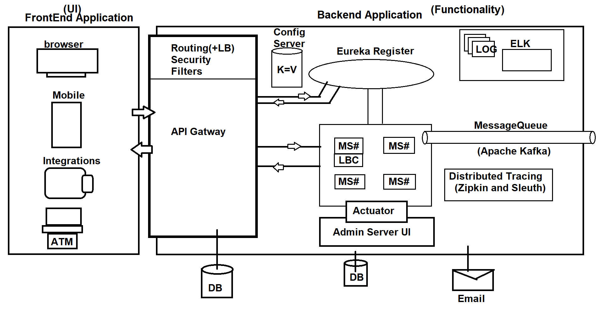

# Microservices

###### 03-November-2021

### Monolithic Application

- Project is a collection of Modules. [ Application is a collection of Service]\
  ex: Amazon Application\
   Services: Search, Cart, Payment, Feedback, Trace...etc

  Gmail Application\
   Services: User (Register, Login), Inbox, Sent, Drafts..etc

  Facebook Application\
  Services: Register, Login, Post, Comment, Like, Friends , Chat ..etc

**Monolithic Application** : Creating a single deployable component (single .jar or .war) for a Project is called as "Monolithic Application"

- Finally above projects converted into Amazon.war, Gmail.war ..etc\
  compile : .java ---> .class\
  Build : .class (+HTML,CSS,Images/..etc) - .jar / .war\
  jar - java archive (stand alone application type)\
  war - web archive (web application types)

- deploy : Place build file inside server and start server.

- Service Instance / Instance :- A successful Deployment setup/Environment

- Load : Client Request (internally one Request = one threads)

- Max Load : Max no.of request allowed by server (for parallel processing)

  - Default is : 200
  - server.jetty.threads.max = 200
  - server.tomcat.threads.max = 200

- Load, MaxLoad, LoadFactor
  - Load = Current no.of Request
  - Max Load = max no.of Request allowed
  - LoadFactor = Current Load/ Max Load

```textile
     LoadFactor = Current Load/ Max Load
                = 100 / 200
                = 0.5
     0 <= LoadFactor <= 1
```

- 0 <= LoadFactor <= 1

- Scaling:- it is a process of increase the performance of system/application.

**Horizontal Scaling :** Creating multiple Service Instances and handle using LBS(Load Balancer Server) is called as Horizontal Scaling.

**Vertical Scaling :** Enhance System hardware capacity. ie RAM, CPU ,HardDisk/SSD..etc

**Load Balancer Server** :- It will dispatch request to Actual Service instance.

- It will choose an Instance which has Less Load Factor.
- If all are having same LF then choose any one Instance in Random.

- LBS will not process request.
- It will dispatch request to ServiceInstance
- Every ServiceInstance is identified using InstanceId(HexaDecimal Value)

###### 06-November-2021

**Microservices :** An independent deployable component, that supports communication with other services. one service as one application. \[ 1 module = 1 project \]. A de-coupled architecture is called as Microservices.

### Monolithic vs Microservice



### Microservice Architecture



### Spring Cloud

###### 08-November-2021

Code/API/Tools to implement application.

**Difference b/w Cloud Computing and Spring Cloud:**

**Cloud Computing :** PaaS, SaaS, IaaS\
 Using Services for rental to deploy/run/moniter our application in internet. (Concept of POST development)\
ex: AWS, Google Cloud, MS-AZURE

**Spring Cloud :** open source Java API given by Pivotal team used to develop application using Microservices Design.

| Concepts                        | Tools/ Softwares                |
| ------------------------------- | ------------------------------- |
| Service(MS#)                    | Spring REST                     |
| Register & Discovery            | Eureka Server                   |
| Config Server                   | Cloud Config(GIT)               |
| API Gateway                     | Zuul(old)/Cloud Gateway         |
| LoadBalancer Consumer           | (old)Ribbon/Cloud Load Balancer |
| Message Queues                  | Apache Kafka                    |
| Distributed Tracing             | Zipkin and Sleuth               |
| Fault Tolerance Circuit Breaker | Hystrix(old)/Resillence4J       |
| Log Tracking                    | ELK                             |
| Security                        | JWT/OAuth 2.x                   |

#### 1. Register and Discovery Server:-

- Every MS# must be registered with R&D Server.
  ie Provide ApplicationName(serviceId), InstanceId, HOST(IP), PORT, LoadFactor ..etc
- Spring Cloud Netflix Eureka Server.

- Eureka Server (Register & Discovery Server)
  | SERVICE-ID | INSTANCE-ID | HOST | PORT | LOADFACTOR |
  | ---------- | ----------- | ----------- | ---- | ---------- |
  | CART | CART-520 | 192.168.0.1 | 9696 | 0/200 |
  | CART | CART-850 | 192.168.0.2 | 9696 | 0/200 |
  | CART | CART-529 | 192.168.0.1 | 8080 | 0/200 |

- we are giving our MS# details to eureka server.

- it is also called as publish operation.

#### 2. Config Server:-

- There can be multiple MS# in our project.
- Every MS# contains properties file (k=v)
- There can be some common key=val exist in every MS#
- Such common key=val define outside of all MS# and shared to all MS# ie config server (github)

#### 3. API Gateway:-

- We should not provide multiple IP/PORT to Client Applications.
- All MS#s runs in private Network. Dont share with outside network
- There must be single entry and exit to MS# Design/Apps.ie API Gateway
- Even API Gatway supports :

  - LoadBalancer (Choose an instance having less load)
  - Filters (Validate Request/Response)
  - Security (User and Role Management)

- API Gateway IP/PORT is given to client teams.
  Request execution flow\
  Client --> Request --> API Gateway --> Eureka --> Service(Microservice)--> Execute Service --> Response --> API Gateway --> Client
- Old Gateway name is : Netflix Zuul, Now we have new API Gtway : Cloud Gateway

#### 4. LoadBalancer Consumer / MS# Intra communication (Consumer concepts):-

- One MS# may need to communicate with other MS# sometimes
- In that case we need Consumer concept(3).

  - DiscoveryClient
  - LoladBalancerClient (old Ribbon)
  - FeignClient \*\*\*\*

    MS#(A) <---------\[Consumer\]-----------> MS#(B)

#### 5. Message Queues:-

- To send data from Source Machine to Destination in continioues flow (with some time period) is called as Message Queue.

  Examples : Live Train status, Swiggy Delivery Status, Ola Cab status, Cricket Score..etc

- DataBase is used to store data
- Message Queues are used to trasfer data.
- Tools : ActiveMQ, RabbitMQ, Apache Kafka..etc

#### 6. Distributed Tracing :-

- There can be multiple MS# in application.
- For a single request multiple MS# can be executed (using Intra communication)
- I want to know ??? (ie Distributed Tracing)
  - How many MS# executed for request?
  - What are they and execution order?
  - Time taken for Specific MS# execution?
- Distributed Tracing -> Zipkin and Sleuth

#### 7. Fault Tolerance / Circuit Breaker:-

- In case MS# executions there can be multiple issues thrown (Casecade exceptions)
- To avoid those for a period of time, execute some dummy services and give messages to endusers.\
  Ex: Try after some time. Service not exist!
- Stop execution of Actual service and give dummy output for some time.

#### 8. Log Tracking | Log Aggregation:-

- There can be multiple MS# in application
- Every MS# can have Log file
- Read all Log files data and show at one place, that is Log Aggregation
- ELK/Splunk ..etc are used for "Log Aggregation".

#### 9. Security :-

- MS# is a stateless design (no HttpSession used at backend)
- So State-management is done at Client side\
  Angular -- ngrx\
  ReactJS -- redux
- **State Management** : Store and trace user data for a period of time(login to logout)
- **Statement Management** Can be done at backend side or frontend side.\
  HttpSession + Cookies are used in java for Statement Management
- Client side State Management, reduces burden on Server, network calls, easy to store and process.
- This security concept is implemented using JWT/SSO[OAuth 2.x] (JSON Web Token / Single Sign On {Oauth 2.x})

#### 10. Actuator with Admin Server:-

- Few readymade services required for any type of project like

  - App Started properly or not?
  - Beans created or not?
  - Env details.
  - Mappings
  - Threads/Heap details
  - Cache details
  - Scheduler..etc
  - (generic services specially used for Production)

- **Actuator :** Actuator gives Production Ready Endpoints (Readymade services for Production Server). But , Actuator must be added in every MS#. So, we need a common palce to view/access all services\
  ie : Admin Server (Central server)

**NOTE :**

- One Maven project can have how many parent projects?
- To link with multiple parents use BOM (Bill Of Materials)
  tags: "\<dependencyManagemenet>"
- Spring Cloud is a collection of MS# Components as a pre-defined project, for every paroject this one must be added.
- But already Spring Boot is a Parent Project. So, this is added to our project using BOM (Bill Of Materials) using a tag "\<dependencyManagement>"
- If we are developing Spring Cloud Applications then internally it uses Spring boot concepts also.
